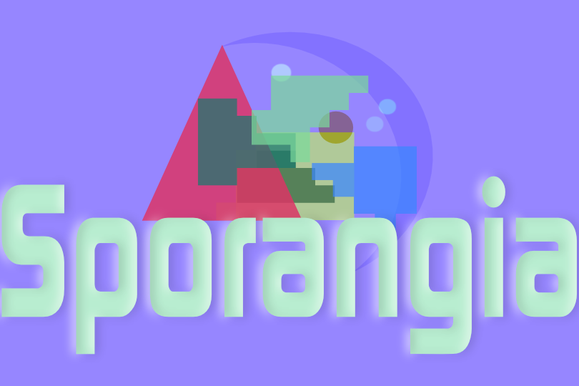

# **NOTE: Sporangia is currently under development and is not yet functional.**

## Sporangia is currently being tested for different UI Frameworks.
## This project is currently solely developed by myself, and I am not an expert in UI.
## If you would like to suggest a framework (I prefer a full Rust stack for this project), please open an issue.
## I  would love to hear your suggestions and would love to have help with this project!

### *Sporangia is an app for editing saves in Pokemon fangames made in RPGMaker.*

## Features

Sporangia is planned to include the following features:

- A user-friendly interface for editing Pokemon stats, moves, abilities, and other properties
- Edit items, trainer variables, and other game data
- Support for importing and exporting Pokemon data from RPGMaker games
- Integration with external tools and plugins for additional functionality

Potential future features include:

- Map editing via other toolings outside RPGMaker

Long term/ Pie-in-the-sky goals:

- Serve as a hub for script creation, editing, and testing.

- Use other languages to script the game, freeing the world from the pain and suffering of RGSS. (Imagine how fun it would be to write a Pokemon game entirely in Cobol! Maybe this is something that sounds dumb enough that you would want to do it and subsequently abandon in 3 weeks!)

## Requirements

Sporangia is currently in development and specific system requirements have not yet been determined. Hopefully not very high!

## Installation

Instructions for installing Sporangia will be provided upon release.

## Contributing

Feel free to submit pull requests and issues. There is no formal contribution guide at this time, but that may change in the future.

## Support

If you encounter any issues with Sporangia, please create a new issue on the project's GitHub repository.

## License

Sporangia is licensed under the [MIT License](https://opensource.org/licenses/MIT). See the `LICENSE` file for more information.

## Acknowledgements
Font used in Sporangia logo is Continuum by Brøderbund Software. Found here: https://www.dafont.com/continuum.font

